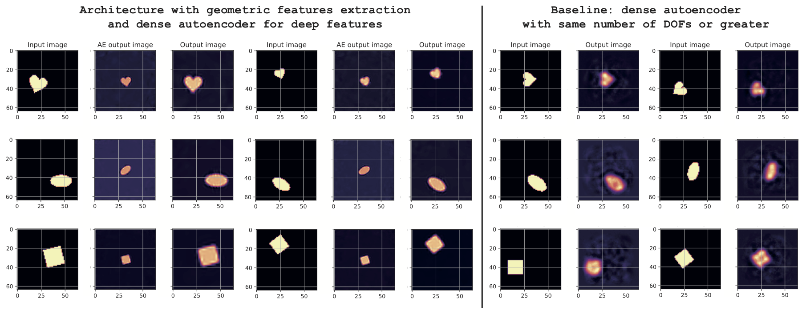

# Unsupervised learning of geometrical features from images by explicit group actions enforcement

<b> Luca Bottero (1), Francesco Calisto (2), Valerio Pagliarino (3) </b> - September 2022 <p>

(1) Università degli Studi di Torino (student), Machine Learning Journal Club <br>
(2) Ludwig-Maximilians-Universität München and Technische Universität München (student), Machine Learning Journal Club <br>
(3) Università degli Studi di Torino (student), Machine Learning Journal Club <br>
    
<p>
Proposal for <b> NeurReps Workshop </b> (NeurIPS conference), Symmetry and Geometry in Neural Representations. New Orleans, 3rd December 2022.
<p>

### Abstract
    
    
In this work we propose an autoencoder architecture capable of automatically learning meaningful geometric features of objects in images, achieving a disentangled representation of 2D objects. It is made of a standard dense autoencoder that captures the \textit{deep features} identifying the shapes, and an additional encoder that extracts geometric latent variables regressed in an unsupervised manner, that are then used to apply a transformation on the output of the \textit{deep features} decoder. We show promising results and that this approach performs better than a non-constrained model having more degrees of freedom.

<p>
    
<b> Keywords: </b> <br>
Autoencoders, group actions, geometric priors, latent space disentanglement
<p>
    
<p align="left" width="700">
  
    
    
### Dependencies
    
```
importlib-metadata  4.12.0
importlib-resources 5.2.2
h5py                2.10.0
matplotlib          3.4.3
numpy               1.19.5
progressbar         2.5
pytorch-ranger      0.1.1
seaborn             0.11.2
torch               1.9.1
torch-optimizer     0.1.0
torchsummary        1.5.1
torchvision         0.10.1
tqdm                4.62.2
```

